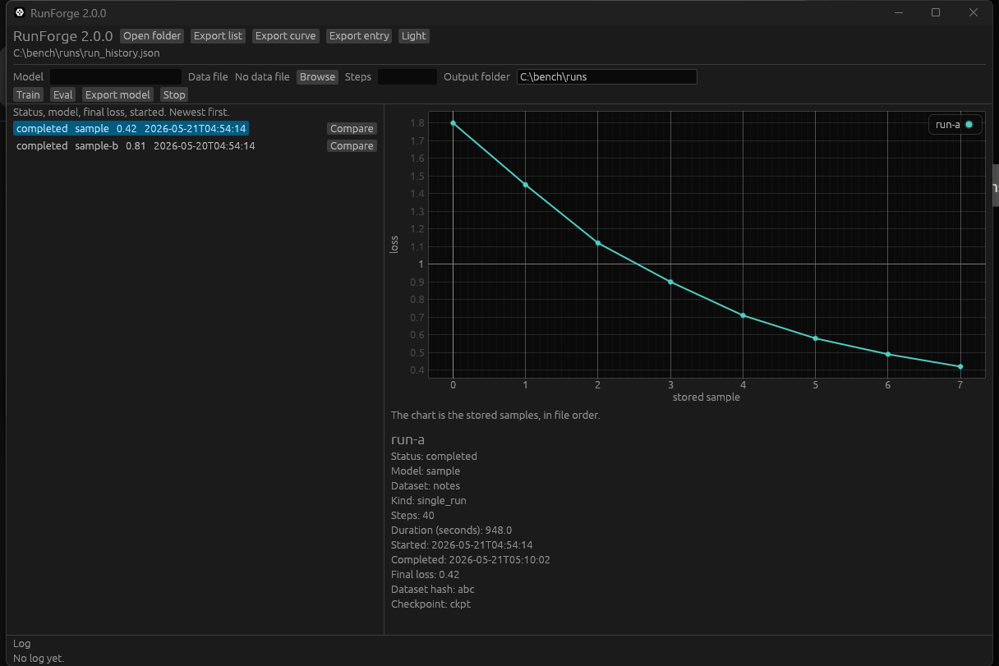

<p align="center">
  <a href="README.md">English</a> | <a href="README.ja.md">日本語</a> | <a href="README.zh.md">中文</a> | <a href="README.es.md">Español</a> | <a href="README.fr.md">Français</a> | <a href="README.hi.md">हिन्दी</a> | <a href="README.it.md">Italiano</a> | <a href="README.pt-BR.md">Português (BR)</a>
</p>

<p align="center"></p>

<p align="center"></p>

<p align="center">
  <a href="https://github.com/mcp-tool-shop-org/runforge/actions/workflows/ci.yml"></a>
  <a href="LICENSE"></a>
  <a href="https://mcp-tool-shop-org.github.io/runforge/"></a>
  <a href="https://mcp-tool-shop-org.github.io/runforge/handbook/"></a>
</p>

# RunForge

RunForge is a Windows instrument for a training record. Open one folder. A series folder draws every stored sample, the shared recipe, and a plain-text report. A backpropagate folder opens the history bench: the run list, the stored loss, a comparison of two rows, and export.

The picture above is the history bench. A series folder is a different screen.

Backpropagate is the trainer. This app does not contain the trainer, does not download a model, and does not ship PyTorch. When `backprop` is already on PATH, Train, Eval, and Export model on the history bench start that command and follow its log. Arguments are built by the app. Nothing is passed through a shell. If `backprop` is missing, the buttons say so. RunForge does not download backpropagate, install it, or vendor it.

## A series folder

The file is `run-config*.json` in the folder you open, and the same names one level down in a child folder. RunForge does not look further down and does not search the disk. One bad file is skipped and counted. A duplicate key refuses that file only.

Each sample stays a record: the epoch or the step, the loss, the learning rate, and every other field that was logged. Every finite sample is drawn. The view is not resampled. A null or non-finite loss is a gap, not a zero. `training_summary.final_loss`, when the file has it, is a marker beside the curve. It is not appended to the line, and the report does not rank by it.

The sidecar prints one report from those measurements. The pane and Save report are the same words. Save uses the same dialog as the history export. Ask may add one short note on how to read the page. That note may not contain a digit, name a setting, or name a verdict. A note that crosses the line is dropped, and the pane says so. If no local model answers, the report still stands.

The model, when you ask, is a local Ollama on `127.0.0.1` port `11434`. A name tagged as cloud is not chosen. The sidecar does not press Train. The question does not include the folder path. A kept note stays with the preferences. It is not written back into the series files.

## The history bench

Open the folder that contains `run_history.json`, or the folder above an `output` directory. The file in the opened folder wins when both exist. The window lists the runs, draws the stored loss, compares two rows, and exports the table or the curve.

The curve is the stored `loss_history`, in file order, at most the samples the trainer kept. `final_loss` is a column. It is not appended to the line. A null sample is a gap, not a zero.

Train, Eval, and Export model stay on this screen. They are not on the series screen.

## Threat model

RunForge reads a folder you pick. A history folder opens `run_history.json` there, or `output/run_history.json` one level down. A series folder opens `run-config*.json` in that folder and in its immediate children. The app does not walk the rest of the disk, and it does not merge the two record kinds. Export and Save report write to a path you pick. Preferences, the last folder and the theme, are written in the package LocalState when the app is packaged, and beside the executable when it is not.

Train, Eval, and Export model start `backprop` only when you press the button on the history bench and that program is already on PATH. The log is that program's output. Stop ends the process tree this window started. The sidecar does not press those buttons.

The sidecar may connect to a model server on the loopback address. The package manifest does not request `internetClient`. There is no telemetry and no account. The report's reference list is inside the program. It is not fetched.

Data it does not touch: the trainer, a model download, an install of backpropagate, a shell, a copy of the environment, a cloud model, or a write back into the series files or `run_history.json`.

Permissions stay on the folder you opened, the export path you pick, the data file you pick, the preferences file, and loopback port `11434` when you ask the local model.

How to report a vulnerability is in [SECURITY.md](SECURITY.md).

## Build

Rust 1.98.1, edition 2024. The toolchain file pins it.

```bash
cargo test --locked --workspace
cargo llvm-cov --locked --workspace --all-targets --lcov --output-path lcov.info --remap-path-prefix --fail-under-lines 90
cargo run -p runforge --locked
```

CI runs the coverage command and uploads `lcov.info`. Codecov fails the status when line coverage is under 90%. The file dialog is not opened by the tests.

## Store

The published listing is product `9PHL1HX0CGMF`, package `mcp-tool-shop.RunForge-Desktop`. Version 2 replaces the earlier classifier app, and the listing text has to say so in the same submission. This repository does not contain that package yet. The package identity does not change when the package is built.

The design of record is [docs/CONTRACT.md](docs/CONTRACT.md). This repository supports the 2.0.0 source build. The published Store app stays the 1.0.1 classifier until a package above `1.0.1.0` is submitted.

Built by [MCP Tool Shop](https://mcp-tool-shop.github.io/).
